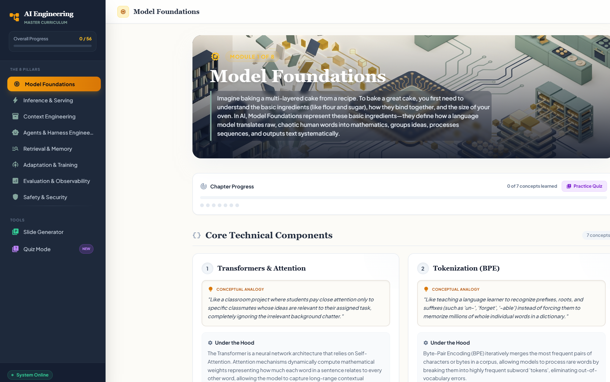

# AI Engineering Handbook

An interactive, single-page learning tool covering the **8 pillars of modern AI engineering** — 56 core concepts explained through plain-language analogies, technical deep-dives, real-world industry use cases (healthcare, manufacturing, agriculture), and memory-palace retention aids.



## Live site

Hosted on GitHub Pages: **https://s-n00b.github.io/ai-engineering-handbook/**

## Features

- **8 chapters / 56 concepts** — Model Foundations, Inference & Serving, Context Engineering, Agents & Harness, Retrieval & Memory, Adaptation & Training, Evaluation & Observability, and Safety & Security.
- **Per-concept industry tabs** — see how each concept applies to healthcare, manufacturing, and agriculture.
- **Full-text search** (`Ctrl/Cmd + K`) across every concept, analogy, and explanation.
- **Quiz / flashcard mode** — review by chapter, all concepts, or only the ones you haven't learned yet.
- **Progress tracking** — mark concepts as learned; progress persists in your browser via `localStorage`.
- **Memory Palace** — a vivid spatial narrative per chapter for long-term retention.
- **Slide Generator** — produces lecture-ready slide content plus image-generation prompts for educators.

## Tech

A single self-contained `index.html` file:

- **React 18** (UMD) + **Babel Standalone** (classic JSX runtime, pinned versions) compiled in-browser.
- **Tailwind CSS** (CDN) for styling.
- No build step required — just open the file or serve it statically.

> Pinned to `@babel/standalone@7.26.4` on purpose: Babel 8's React preset defaults to the automatic JSX runtime, which emits ES-module imports that cannot run inside a plain `<script>` tag.

## Run locally

Because it loads libraries from CDNs, an internet connection is required. You can open the file directly, or serve it:

```bash
python -m http.server 8000
# then visit http://127.0.0.1:8000/
```

## License

© 2026 AI Engineer Alliance.
